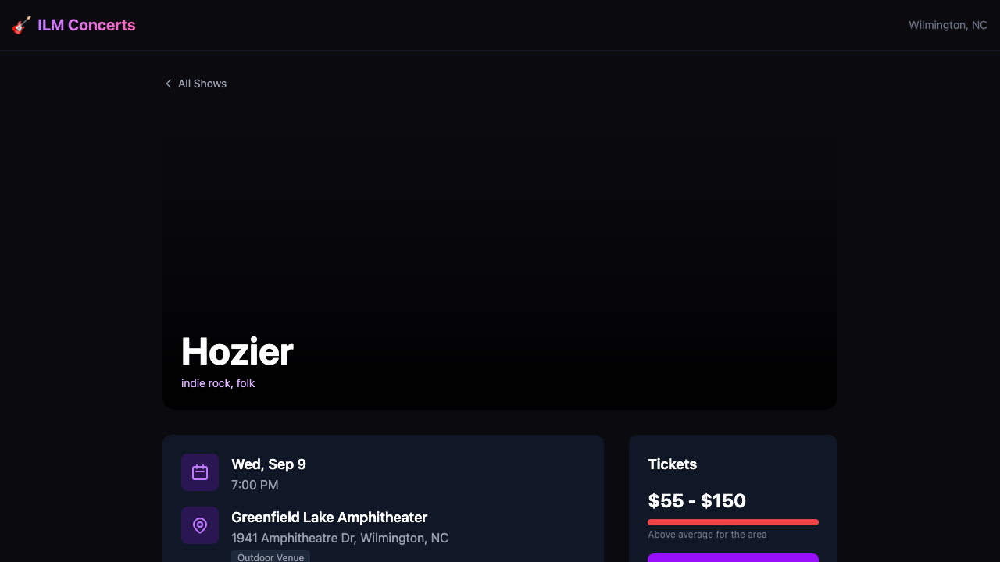

# <div align="center">App-ConcertsNearMe</div>

<div align="center">
  A local concert discovery product that turns fragmented venue listings into one clean decision surface.
</div>

<div align="center">
  <br />
  
</div>

## Why This Exists

Finding a great show in a single city usually means checking too many disconnected sources, comparing prices manually, and losing context on whether a ticket is actually a good buy.

App-ConcertsNearMe pulls that journey into one place so a user can quickly answer:

- what is happening soon
- which shows are worth the money
- what venue and weather context matters
- whether the artist is compelling enough to act on now

## Product Value

| Outcome | What the app gives the user |
| --- | --- |
| Faster discovery | Aggregates upcoming concerts into one searchable, filterable experience |
| Better ticket decisions | Frames price ranges with visual affordability categories |
| More confidence before purchase | Adds venue, date, weather, and source context to each event |
| Richer artist evaluation | Supports artist imagery and music-preview oriented exploration |

## Core Experience

The product is designed around a simple loop:

1. Scan upcoming concerts in one city-centric feed.
2. Filter by venue, date, search term, or price band.
3. Open an event to evaluate artist, venue, weather, and ticket quality.
4. Decide whether to buy now or keep browsing.

## What Makes It Different

This is not just a list of scraped events. The app is structured to become a richer show-selection assistant.

- multi-source aggregation across major ticketing feeds and local venues
- affordability framing instead of raw ticket numbers alone
- weather-aware context for outdoor shows
- artist enrichment for deeper pre-purchase confidence

## Product Snapshot

The detail page is the best expression of the product today because it combines the key decision inputs in one screen:

- artist identity and genre context
- venue and date details
- outdoor indicator and weather outlook
- price banding and ticket source

## Best Fit

This repo is a strong fit if you want to:

- build a city-based live-events discovery experience
- prototype a consumer app on top of aggregated event data
- combine ticketing, enrichment, and ranking signals into one interface
- expand toward recommendation, notifications, or personalized planning

## Architecture

```text
Next.js App
  -> browse concerts
  -> filter inventory
  -> inspect event detail

API Routes
  -> /api/events
  -> /api/events/[id]
  -> /api/refresh

Local Data Layer
  -> Prisma
  -> SQLite
  -> seeded sample concert data

Enrichment Model
  -> ticket sources
  -> artist metadata
  -> top songs
  -> weather context
```

## Local Run

```bash
npm install
DATABASE_URL='file:./dev.db' npx prisma db push
DATABASE_URL='file:./dev.db' npx prisma db seed
npm run dev
```

Then open `http://localhost:3000`.

## Verified Baseline

As of September 2, 2026, the current repo baseline was verified to:

- install successfully
- build successfully with `npm run build`
- run locally against seeded SQLite data
- serve event inventory through the existing API routes

## Deeper Product Docs

Longer-form planning and design artifacts live in:

- [`docs/plans/2026-03-09-concerts-near-me-plan.md`](docs/plans/2026-03-09-concerts-near-me-plan.md)
- [`docs/plans/2026-03-09-concerts-near-me-design.md`](docs/plans/2026-03-09-concerts-near-me-design.md)

## Roadmap Direction

The strongest next moves are product-depth features, not more scaffolding:

- personalized alerts and recommendations
- stronger ranking and deduplication across sources
- richer venue and neighborhood context
- cleaner mobile-first browsing and event comparison
