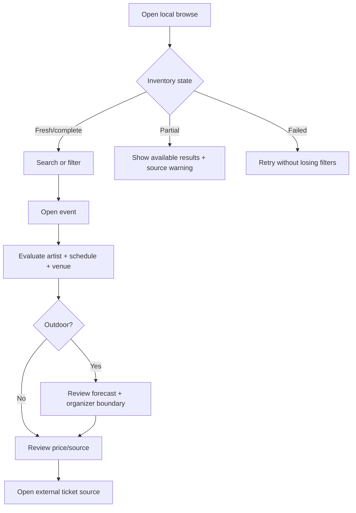

# Core experience wireframes

Values and event names below are illustrative placeholders, not live inventory.

## 1. Local browse and shortlist

```text
┌────────────────────────────────────────────────────────────┐
│ LIVE MUSIC IN WILMINGTON                                  │
│ 24 upcoming shows · refreshed 38m ago · 2 sources         │
│ Coverage: Ticketmaster, SeatGeek   [What may be missing?]  │
│                                                            │
│ [Search artist or venue.................................]  │
│ [This weekend] [Venue ▼] [Price ▼] [More dates] [Clear]   │
│                                                            │
│ ┌──────────────────────┐  ┌──────────────────────┐         │
│ │ ARTIST IMAGE         │  │ ARTIST IMAGE         │         │
│ │ Rain expected        │  │                      │         │
│ │ Artist / Venue       │  │ Artist / Venue       │         │
│ │ Fri 8:00 · $25–45    │  │ Sat 7:30 · Price N/A │         │
│ │ $$ Relative: typical │  │ [View details]       │         │
│ └──────────────────────┘  └──────────────────────┘         │
└────────────────────────────────────────────────────────────┘
```

Why: source coverage and freshness precede count. Missing price is neutral, never green/budget.

## 2. Event evaluation

```text
┌────────────────────────────────────────────────────────────┐
│ ‹ All shows                                                │
│ [Artist image]                                             │
│ ARTIST NAME · genres                                       │
├───────────────────────────────────┬────────────────────────┤
│ WHEN / WHERE                      │ TICKETS                │
│ Fri, Oct 9 · 8:00 PM              │ $25–45                 │
│ Greenfield Lake Amphitheater      │ Relative to current    │
│ 1941 … · Outdoor                  │ listed Wilmington set  │
│                                   │ Price checked: 38m ago │
│ WEATHER OUTLOOK                   │ Fees/inventory may vary│
│ Rain possible · 65% · 12 mph      │ [Open Ticketmaster]    │
│ Forecast only—check organizer.    │                        │
│ [Venue/event status]              │                        │
│                                   │                        │
│ HEAR THE ARTIST                   │                        │
│ [▶ Track] [Open in Spotify]       │                        │
└───────────────────────────────────┴────────────────────────┘
```

The content reflects [`src/app/event/[id]/page.tsx`](../../src/app/event/[id]/page.tsx), with proposed freshness and boundary copy.

## 3. Weather warning

```text
┌──────────────────────────────────────────┐
│ ⚠ Rain expected for this outdoor venue  │
│ Forecast: light rain · 65% · wind 12 mph│
│ Updated 38m ago                          │
│ This is not a cancellation notice.       │
│ [Check venue/event source] [Tickets]      │
└──────────────────────────────────────────┘
```

Weather severity exists in the data model; organizer status does not.

## 4. Unknown price

```text
┌──────────────────────────────────────────┐
│ Tickets                                  │
│ Price unavailable                        │
│ No affordability band is assigned.       │
│ Final price and fees are on the source.  │
│ [Check current tickets]                  │
└──────────────────────────────────────────┘
```

This corrects the product interpretation risk in [`src/lib/services/price-calculator.ts`](../../src/lib/services/price-calculator.ts), where null currently maps to `green`.

## 5. Loading, empty, partial, and error

```text
LOADING                    FILTERED EMPTY
┌─────────────────────┐    ┌────────────────────────────┐
│ Gathering local     │    │ No shows match filters.    │
│ listings…           │    │ [Clear filters] [Next 30d] │
│ [skeleton cards]    │    └────────────────────────────┘
└─────────────────────┘

PARTIAL SOURCE              ERROR
┌─────────────────────┐    ┌────────────────────────────┐
│ Some listings may   │    │ Shows could not be loaded. │
│ be missing.         │    │ Your filters are preserved.│
│ SeatGeek refresh    │    │ [Retry] [Source status]    │
│ failed at 2:10 PM.  │    └────────────────────────────┘
└─────────────────────┘
```

The current home page has skeleton and filtered-empty states but logs fetch errors without a recovery surface.

## Flow



## Information hierarchy

1. Coverage and freshness.
2. Artist, date, venue.
3. Actual price availability and relative context.
4. Outdoor-weather exception.
5. Artist enrichment.
6. External transaction action.

## Accessibility and responsive notes

- Price/weather bands require text and icons, not color alone.
- Artist images need meaningful alt text only when informative; decorative weather icons use adjacent labels.
- Cards and nested ticket actions must have unambiguous keyboard/focus behavior.
- Announce result-count changes after debounced filters without moving focus.
- On small screens, stack ticket panel below event essentials; keep primary source action reachable.
- Respect reduced motion for hover scaling, skeletons, and audio controls.
- Audio preview requires labeled play/pause state and must never autoplay.
- Date/time should expose locale and timezone explicitly.
